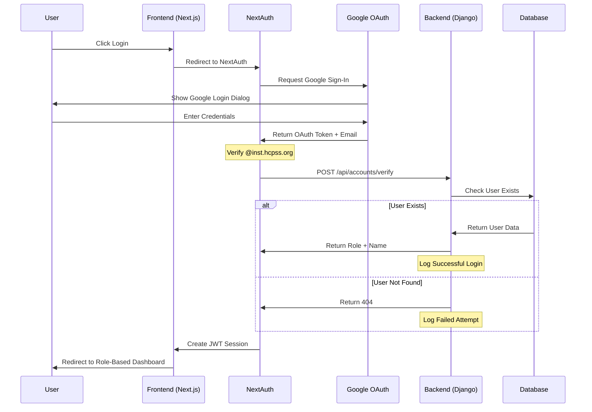

# Authentication Flow Documentation

## Current Authentication Components

### Frontend (Next.js)
✅ Google OAuth2 Integration
✅ NextAuth Configuration
✅ Domain Restriction (@inst.hcpss.org)
✅ Error Page
✅ Login UI
✅ Session Management (JWT)

### Backend (Django)
✅ User Model with Roles
✅ Email Verification Endpoint
✅ Authentication Logging
✅ Real-time Monitoring
✅ Failed Attempt Tracking

### Security Features
✅ JWT Session Strategy
✅ CORS Configuration
✅ Domain Restriction
✅ Detailed Security Logging
✅ IP and User Agent Tracking

## Remaining Tasks

1. **Role-Based Access Control** (Priority: High)
   - [ ] Implement middleware to check user roles
   - [ ] Create role-specific routes
   - [ ] Add role verification to protected endpoints

2. **Session Management** (Priority: Medium)
   - [ ] Add session revocation endpoint
   - [ ] Implement session refresh logic
   - [ ] Add concurrent session handling

3. **Testing** (Priority: High)
   - [ ] Unit tests for authentication endpoints
   - [ ] Integration tests for Google OAuth flow
   - [ ] Security testing (rate limiting, session hijacking)

4. **Optional Enhancements**
   - [ ] Add rate limiting for failed attempts
   - [ ] Implement account lockout after X failed attempts
   - [ ] Add admin notifications for suspicious activity
   - [ ] Set up automated security reports

## Recommendation

The core authentication system is functional and secure. Priority tasks:

1. **Immediate**:
   - Implement role-based middleware
   - Add basic authentication tests

2. **Next Phase**:
   - Session management features
   - Rate limiting
   - Security testing

3. **Future Enhancements**:
   - Account lockout
   - Admin notifications
   - Security reporting

The current implementation is production-ready for basic authentication needs, but adding role-based access control is essential before deployment.
